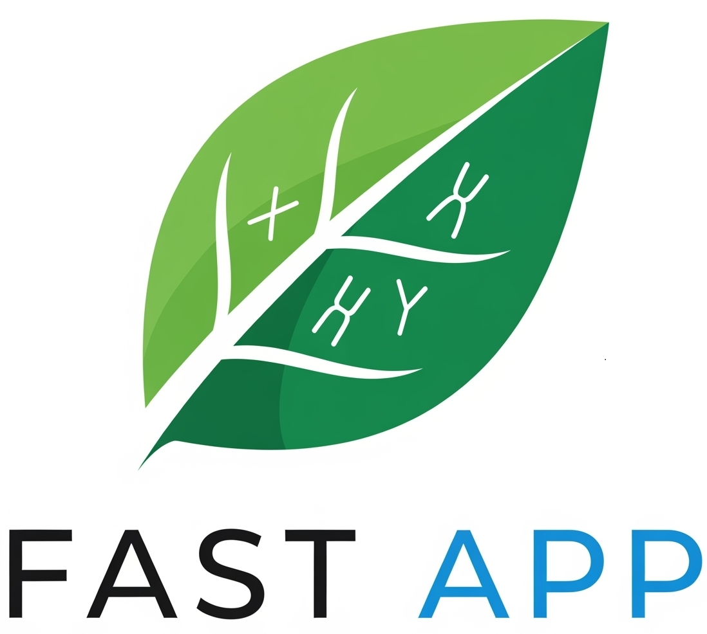

# Fast App

  

This application is an aggregator of [FastQC](https://github.com/s-andrews/FastQC), [Fastp](https://github.com/OpenGene/fastp) and [HybPiper](https://github.com/mossmatters/HybPiper). It abstracts those CLI applications to a simple, easy-to-use interface to streamline research efforts.

## Installation

* Download the latest release from the [GitHub Releases](https://github.com/danielmapar/fast/releases/latest) page.

* Give the `FastApp` executable permissions by right-clicking on it and selecting `Properties` > `Permissions` > `Allow executing file as program`.

* Run the app by double-clicking on the `FastApp` executable.

## Demo Video

## Local Development

In case you want to contribute to the project, you can follow the steps below:

* Install [Git](https://git-scm.com/downloads).

* Clone the repository: `git clone git@github.com:danielmapar/fast.git`

* For **Windows users only**:
    * Disable Hyper-V by running `bcdedit /set hypervisorlaunchtype off` as administrator.
    * Reboot your machine.

* Install [Virtual Box](https://download.virtualbox.org/virtualbox/7.0.22/) version `7.0.22`.
  * Be mindful of version `7.1.x` as it presents many networking issues. More [here](https://forums.virtualbox.org/viewtopic.php?t=112405).
  
* Install [Vagrant](https://developer.hashicorp.com/vagrant/downloads).

* Run `vagrant up --provision`.

* Reload the VM: `vagrant reload`
  * This should open a new window with the desktop environment.
  * Run `vagrant ssh` in case you need access to the VM terminal.

* Follow the instructions in the [app/README.md](app/README.md) file to run the FastApp.

## Contributors

* [Daniel Marchena Parreira](https://github.com/danielmapar)

## License

This project is licensed under the MIT License - see the [LICENSE](LICENSE) file for details.
